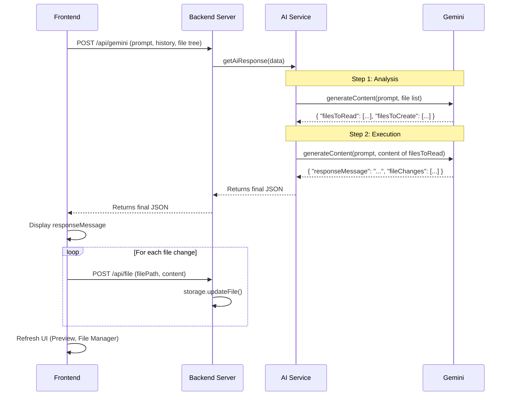

# GeoFire '99 - Technical Deep Dive

A 7-slide presentation explaining the technical architecture and AI integration of the GeoFire '99 application.

---

### **Slide 1/7: Title Slide**

<br>

<p align="center">
  
</p>
<h1 align="center">GeoFire '99 - Technical Deep Dive</h1>
<h3 align="center">An Architectural Review</h3>
<p align="center"><em>Prepared by a World-Class Senior Frontend Engineer</em></p>

---

### **Slide 2/7: Application Architecture Overview**

This diagram illustrates the high-level interaction between the system's core components.

```mermaid
graph TD
    subgraph "User's Computer"
        A[Browser <br/>(IE6-Compatible Frontend)]
    end

    subgraph "Localhost Server"
        B[Node.js Backend <br/>(Express.js)]
        C[File System <br/>(user_sites/)]
        D[AI Service <br/>(lib/ai_service.js)]
    end

    subgraph "External"
        E[Google Gemini API]
    end

    A -- "HTTP API Calls" --> B
    B -- "Read/Write Files" --> C
    B -- "Delegates AI tasks" --> D
    D -- "API Calls" --> E
```

**Key Architectural Tenets:**

- **Full-Stack Simulation:** A Node.js backend and vanilla JS frontend work together to replicate a complete 1999 web hosting service.
- **Retro-First Development:** All code is written to be compatible with Internet Explorer 6, enforcing the limitations and patterns of the era.
- **AI as a Core Feature:** The Google Gemini API is not just an add-on; it's the engine that drives the primary site-building functionality.
- **Modular & Extensible:** The application is built with a clean separation of concerns, featuring a robust, registry-based plugin system.

---

### **Slide 3/7: The Retro Frontend**

The frontend is engineered to work within the significant constraints of a 1999 web browser.

**Technology:**

- **HTML 4.01 Transitional:** Using `<table>` elements for layout.
- **CSS1 / CSS2:** Limited selectors and properties.
- **Vanilla JavaScript (ES3):** No `let`/`const`, arrow functions, or modern Array methods.

**Key Compatibility Patterns:**

- **AJAX:** `XMLHttpRequest` with a fallback to `ActiveXObject` for IE6.
- **JSON Parsing:** Lightweight polyfills using `eval()` to parse JSON data when the native `JSON` object is unavailable.
- **"Asynchronous" File Uploads:** A hidden `<iframe>` is used as the target for the file upload form—the standard technique for AJAX-like file uploads before XHR2.
- **Event Handling:** A wrapper that uses modern `addEventListener` with a fallback to the proprietary `attachEvent` for IE.

---

### **Slide 4/7: The AI Core: Prompt & Persona**

The assistant's behavior is governed by sophisticated prompt engineering and structured output requirements.

**1. The System Prompt is Everything:**
A detailed `systemInstruction` sent with every API call defines the AI's core identity and rules:

- **Rich Persona:** A Y2K-fearing AI from 1999 that believes it laid off its human coworkers.
- **Dual Modes:** Behaves as a "no-nonsense developer" for coding tasks and a "grumpy curmudgeon" for off-topic chats.
- **Strict Technical Rules:** The prompt explicitly commands the AI to _only_ generate retro-compatible code (HTML4, `<table>` layouts, ES3 `var`, etc.) and to proactively _correct_ any modern code submitted by the user.

**2. Structured JSON Output:**

- The API call forces Gemini to respond with a valid JSON object by specifying `responseMimeType: "application/json"` and providing a strict `responseSchema`.
- This guarantees that the AI's output is always machine-readable, preventing unpredictable results and making the integration reliable.

---

### **Slide 5/7: The AI Workflow: From Prompt to File**

This flowchart shows the end-to-end process of the AI modifying a user's website.



**The Process:**

1.  **Context Assembly (Frontend):** The builder gathers the user's prompt, the full chat history, and the user's complete file tree.
2.  **API Request (Backend):** This context is sent to the `/api/gemini` endpoint.
3.  **Gemini Call:** The server combines the context with the system prompt and response schema, then queries the Gemini API.
4.  **Structured Response:** Gemini returns a JSON object containing a chat message and an array of `fileChanges`.
5.  **File Update Loop (Frontend):** The frontend receives the `fileChanges` array and sends a _separate_ API request for each file to be created or updated.
6.  **Disk Write (Backend):** The backend's file-writing endpoint uses the `storage` library to securely write the new content to the user's directory on the file system.
7.  **UI Refresh:** The File Explorer and Preview windows are updated to show the changes.

**Code Samples in Action:**

1.  **Defining the AI's Output (`server.js`):** The server enforces a strict JSON schema for the AI's response.

    ```javascript
    const responseSchema = {
      type: Type.OBJECT,
      properties: {
        responseMessage: { type: Type.STRING },
        fileChanges: {
          type: Type.ARRAY,
          items: {
            type: Type.OBJECT,
            properties: {
              filePath: { type: Type.STRING },
              content: { type: Type.STRING }
            },
            required: ['filePath', 'content']
          }
        }
        // ... requiredImages schema
      },
      required: ['responseMessage', 'fileChanges', 'requiredImages']
    };
    ```

2.  **Example AI JSON Response:** The AI generates a JSON object matching the schema.

    ```json
    {
      "responseMessage": "I have created the 'about.html' page as you requested and added a link to it from your home page.",
      "fileChanges": [
        {
          "filePath": "index.html",
          "content": "<!DOCTYPE...>...<a href=\"about.html\">About Me</a>...</body></html>"
        },
        {
          "filePath": "about.html",
          "content": "<!DOCTYPE...><html><body><h1>About Me</h1></body></html>"
        }
      ],
      "requiredImages": []
    }
    ```

3.  **Processing the Response (Frontend):** The frontend receives the JSON and applies the changes.

    ```javascript
    // In components/builder/ai_assistant.js
    var aiResponse = data.content;
    var fileChanges = aiResponse.fileChanges || [];
    if (fileChanges.length > 0) {
      // B.saveAllFiles iterates through the array and sends each
      // file to the backend to be written to disk.
      B.saveAllFiles(fileChanges, B.refreshAll);
    }
    ```

---

### **Slide 6/7: Storage & The Plugin System**

The backend is designed for simplicity, security, and extensibility.

**Storage (`lib/storage.js`):**

- **Simplicity:** User sites are just folders and files on the local disk (`user_sites/{neighborhood}/{username}`). This makes the generated content easy to inspect.
- **Metadata:** A single `meta.json` file in each user's root directory stores the (non-secure) password hash and all active plugin configurations.
- **Security:** The `_securePath` function is the most critical security feature. It resolves all file paths and verifies they are inside the user's designated directory, effectively preventing path traversal attacks.

**Plugins (`plugins/`, `lib/plugin_service.js`):**

- **Central Registry:** `plugins/registry.js` acts as a single source of truth, defining all available plugins, their descriptions, and their options.
- **Robust Snippet Injection:** The plugin service uses HTML comments (e.g., `<!-- Hit Counter Plugin -->`) and regular expressions to reliably inject and remove code blocks from the user's `index.html`. It intelligently cleans up all old snippets before adding the new ones, preventing orphaned code.
- **Lifecycle Hooks:** Plugins can define `onInstall` and `onUninstall` functions (e.g., used by the Guestbook to create/delete its dedicated `guestbook.html` page).

**Code Samples in Action:**

1.  **Plugin Snippet Definition (`plugins/webring.js`):** Each plugin defines the HTML it needs to inject.

    ```javascript
    webring.getSnippet = function (username, neighborhoodCode) {
      const neighbors = _getWebRingNeighbors(username, neighborhoodCode);
      const prevUrl = `/${neighborhoodCode}/${neighbors.prev}/`;
      const nextUrl = `/${neighborhoodCode}/${neighbors.next}/`;
      // ...
      return `<!-- Web Ring Plugin -->
    <br><center>
    <table ...><tr><td>
      [ <a href="${prevUrl}">Previous</a> | ... | <a href="${nextUrl}">Next</a> ]
    </td></tr></table>
    </center>
    <!-- /Web Ring Plugin -->`;
    };
    ```

2.  **Intelligent Injection Logic (`lib/html_injector.js`):** A dedicated utility intelligently places the snippet in the document.

    ```javascript
    function inject(htmlContent, snippet) {
      const isHeadSnippet = snippet.indexOf('<script') !== -1 || snippet.indexOf('<bgsound') !== -1;

      if (isHeadSnippet) {
        // Place scripts/sounds in the <head>
        if (/<\/head>/i.test(htmlContent)) {
          return htmlContent.replace(/<\/head>/i, `\n${snippet}\n</head>`);
        }
        // Fallback to <body>
      } else {
        // Place visible content just before the closing </body> tag
        if (/<\/body>/i.test(htmlContent)) {
          return htmlContent.replace(/<\/body>/i, `\n${snippet}\n</body>`);
        }
      }
      return htmlContent + `\n${snippet}`; // Last resort
    }
    ```

3.  **Applying the Snippet (`lib/plugin_service.js`):** The service gets the snippet and calls the injector.

    ```javascript
    // (Inside a loop for each active plugin)
    const pluginModule = require('../plugins/' + PluginRegistry[pluginConfig.id].module);
    const snippet = pluginModule.getSnippet(username, neighborhoodCode, pluginConfig.options);

    // indexContent is the full HTML of the user's index.html file
    indexContent = inject(indexContent, snippet);
    ```

---

### **Slide 7/7: Conclusion & Key Takeaways**

- **Excellence in Constraint:** The project successfully achieves an authentic retro experience by fully embracing the technological limitations of the 1999 web. The challenges are not avoided; they are the core design feature.

- **Advanced AI Application:** This is a powerful demonstration of the Gemini API. It uses detailed system prompts and structured JSON output to create a reliable and highly functional content generation tool, not just a simple chatbot.

- **Solid & Secure Architecture:** The application features a well-structured, secure, and modular design. It proves that clean architecture is not dependent on modern frameworks.

- **A Masterclass in Detail:** Features like the `<iframe>` file upload, `ActiveXObject` fallbacks, and the AI's Y2K persona show a deep commitment to creating a complete and convincing simulation.

**GeoFire '99 is a robust, creative, and technically impressive application that masterfully blends modern AI with retro-tech nostalgia.**
